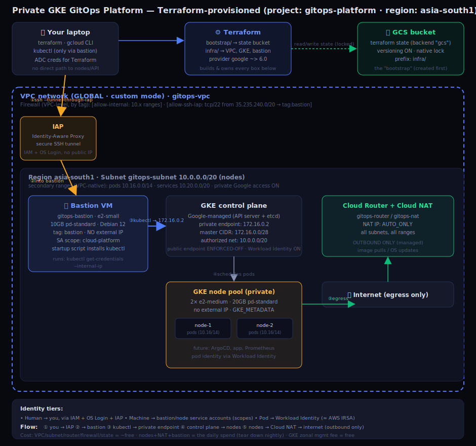

# GitOps Platform on GKE — Terraform

A **private, production-style Google Kubernetes Engine (GKE) cluster**, provisioned entirely with Terraform, with remote state, private networking, and secure cluster access through an IAP-tunnelled bastion. No component is exposed to the public internet.

> Built as a hands-on learning + portfolio project. A parallel version exists on AWS (EKS) — the two make a concrete comparison of GCP vs AWS networking and IAM.

---

## Architecture



**In one sentence:** A developer's `terraform apply` builds a global VPC with a regional subnet, a private GKE cluster (private nodes + private control-plane endpoint), Cloud NAT for outbound egress, and an IAP-accessed bastion for admin — with Terraform state stored remotely in a GCS bucket. The Kubernetes API is reachable only from inside the VPC, via the bastion.

### Components

| Layer | Resource | Notes |
|---|---|---|
| **State** | GCS bucket | Remote Terraform backend, versioning ON, native locking |
| **Network** | VPC (global, custom mode) | `gitops-vpc` |
| | Subnet (regional) | `10.0.0.0/20` nodes + secondary ranges: pods `10.16.0.0/14`, services `10.20.0.0/20` (VPC-native) |
| | Cloud Router + Cloud NAT | Outbound-only egress for private nodes (image pulls) |
| | Firewall rules | VPC-level, by tag: `allow-internal`, `allow-ssh-iap` (tcp/22 from `35.235.240.0/20`) |
| **Cluster** | GKE control plane | Private endpoint `172.16.0.2`, master CIDR `172.16.0.0/28`, authorized network `10.0.0.0/20`, Workload Identity ON |
| | Node pool | 2× `e2-medium`, 20GB `pd-standard`, private (no external IP) |
| **Access** | IAP + Bastion VM | `e2-small`, no external IP, SSH only via IAP; runs `kubectl` against the private endpoint |

---

## Repository layout

```
.
├── bootstrap/          # creates the GCS state bucket (local state — chicken & egg)
│   ├── terraform.tf
│   └── main.tf
├── infra/              # the real stack (remote state in GCS)
│   ├── terraform.tf    # backend "gcs" + provider versions
│   ├── providers.tf
│   ├── network.tf      # VPC, subnet, router, Cloud NAT, firewall
│   ├── gke.tf          # private GKE cluster + node pool + authorized networks
│   └── bastion.tf      # IAP API, SSH firewall, bastion VM
└── docs/
    └── architecture.svg
```

---

## Prerequisites

- `gcloud` CLI, `terraform` (>= 1.5), `kubectl`, `gke-gcloud-auth-plugin`
- A GCP project with billing enabled and a **budget alert** set
- Authenticated CLI + Terraform credentials:
  ```bash
  gcloud auth login
  gcloud auth application-default login
  gcloud config set project <PROJECT_ID>
  gcloud services enable compute.googleapis.com container.googleapis.com iam.googleapis.com iap.googleapis.com
  ```

---

## Deploy

**1. Bootstrap the state bucket (once):**
```bash
cd bootstrap
terraform init && terraform apply
```

**2. Provision the stack:**
```bash
cd ../infra
terraform init      # connects to the GCS backend
terraform plan      # review: VPC, NAT, firewall, GKE, bastion
terraform apply
```

**3. Connect to the cluster (via the bastion):**
```bash
# SSH into the bastion through IAP (no public IP, no SSH exposed to the internet)
gcloud compute ssh gitops-bastion --zone asia-south1-a --tunnel-through-iap

# on the bastion — kubectl is pre-installed by the startup script
gcloud container clusters get-credentials gitops-gke --zone asia-south1-a --internal-ip
kubectl get nodes
```

`--internal-ip` points kubeconfig at the private endpoint `172.16.0.2`, reachable only from inside the authorized VPC subnet.

---

## Tear down (cost control)

The VPC, subnet, router, firewall and state bucket are effectively free — leave them up. The cluster, NAT and bastion cost money, so destroy them when not in use:

```bash
cd infra
terraform destroy \
  -target=google_container_cluster.gke \
  -target=google_compute_instance.bastion \
  -target=google_compute_router_nat.nat
```

Verify nothing expensive lingers (watch for orphaned disks):
```bash
gcloud container clusters list
gcloud compute instances list
gcloud compute disks list
```

Rebuild next time with `terraform apply` (the bastion re-provisions its tools via a startup script).

---

## Design decisions

- **Private cluster + IAP bastion** over a public endpoint — zero internet exposure for nodes, control plane, or SSH. Access is IAM-governed and audit-logged (GCP's IAP ≈ AWS SSM Session Manager).
- **Zonal cluster** over regional — cheaper, fewer disks, qualifies for the free management tier; single-zone availability is acceptable for this environment.
- **`pd-standard` disks** + inline node pool — avoids the (non-adjustable on trial) `SSD_TOTAL_GB` quota; the bootstrap default node pool otherwise uses SSD-backed disks.
- **VPC-native networking** — pods/services get real routable IPs from secondary ranges; pod range sized large (`/14`) because it can't be resized after creation.
- **Workload Identity enabled** — pods get least-privilege Google access via ServiceAccount mapping, no static keys (the GKE equivalent of AWS IRSA).
- **Remote state in GCS** with versioning + native locking — reproducible, recoverable, safe for concurrent runs.

---

## GCP vs AWS — networking & IAM (what differs)

| Concept | AWS | GCP |
|---|---|---|
| VPC scope | per region | **global** |
| Subnet scope | per AZ | **regional** (spans zones) |
| Public/private | subnet route table (IGW vs NAT) | **per-instance** (external IP or not) |
| Outbound for private | NAT Gateway (self-run) | Cloud NAT (managed) |
| Firewall | Security Group (per-resource) | Firewall rule (per-VPC, by **tag**) |
| Pod identity | IRSA | Workload Identity |
| Private API admin | bastion / SSM Session Manager | bastion + **IAP** |

---

## Notable engineering challenges solved

- **GKE creation failed on `SSD_TOTAL_GB` quota** (non-adjustable on a trial account) — root-caused to a regional cluster spreading SSD-backed `pd-balanced` disks across zones, plus orphaned disks from failed attempts. Fixed with a zonal cluster on `pd-standard` disks + inline node pool.
- **`deletion_protection` defaults to `true`** on the GKE provider — blocked teardown until explicitly disabled; cleaned tainted state with `terraform state rm`.
- **Private-endpoint enforcement** made the control plane unreachable from the laptop (`EOF`) — solved by building the IAP bastion and authorizing the VPC subnet on the control plane.
- **Terraform provider/version conflicts** and **S3-backend region redirects** (on the AWS counterpart) — resolved via constraint + lock-file management.

---

## Roadmap

- ArgoCD on GKE from a Git repo — full multi-env (dev/prod) GitOps with Kustomize overlays
- Workload Identity mapping for a pod that calls a Google API
- Observability: kube-prometheus-stack + Grafana (RED method, SLO/error budget)
- Refactor networking + bastion into reusable Terraform modules with least-privilege service accounts
